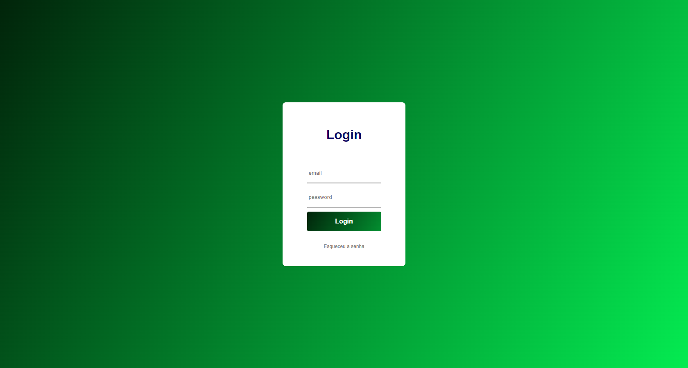

## Pagina de Login, utilizando REST-API e regex para validação de login
#### Obs: ao digitar algum e-mail inválido aparecerá uma barra vermelha indicando que algo está errado.
#### Já sobre a senha, se a mesma não tiver no mínimo 8 digitos e não for a senha correta, a barra vermelha também será exibida para o usuário
#### Sobre o botão de login o mesmo exibe uma mensagem informando que o login está correto ou não.
#### Para realizar o teste com sucesso esses são os dados corretos:
#### E-mail: eve.holt@reqres.in
#### Senha: cityslicka

#### Meus Contatos

 
  
   

<a href="https://joaodedeusrsfilho.github.io/paginadelogin/"> Clique aqui para acessar o site.</a>
 

